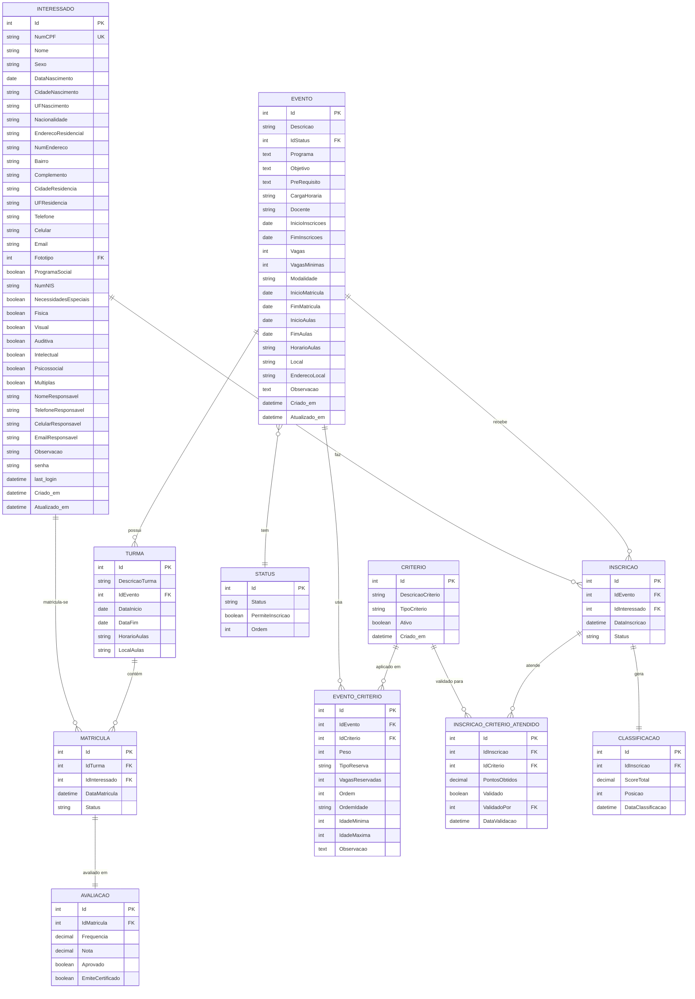

```mermaid
erDiagram
    INTERESSADO ||--o{ INSCRICAO : "faz"
    INTERESSADO ||--o{ MATRICULA : "matricula-se"
    
    EVENTO ||--o{ INSCRICAO : "recebe"
    EVENTO ||--o{ TURMA : "possui"
    EVENTO }o--|| STATUS : "tem"
    EVENTO ||--o{ EVENTO_CRITERIO : "usa"
    
    CRITERIO ||--o{ EVENTO_CRITERIO : "aplicado em"
    CRITERIO ||--o{ INSCRICAO_CRITERIO_ATENDIDO : "validado para"
    
    INSCRICAO ||--|| CLASSIFICACAO : "gera"
    INSCRICAO ||--o{ INSCRICAO_CRITERIO_ATENDIDO : "atende"
    
    TURMA ||--o{ MATRICULA : "contém"
    MATRICULA ||--|| AVALIACAO : "avaliado em"
    
    INTERESSADO {
        int Id PK
        string NumCPF UK
        string Nome
        string Sexo
        date DataNascimento
        string CidadeNascimento
        string UFNascimento
        string Nacionalidade
        string EnderecoResidencial
        string NumEndereco
        string Bairro
        string Complemento
        string CidadeResidencia
        string UFResidencia
        string Telefone
        string Celular
        string Email
        int Fototipo FK
        boolean ProgramaSocial
        string NumNIS
        boolean NecessidadesEspeciais
        boolean Fisica
        boolean Visual
        boolean Auditiva
        boolean Intelectual
        boolean Psicossocial
        boolean Multiplas
        string NomeResponsavel
        string TelefoneResponsavel
        string CelularResponsavel
        string EmailResponsavel
        string Observacao
        string senha
        datetime last_login
        datetime Criado_em
        datetime Atualizado_em
    }
    
    EVENTO {
        int Id PK
        string Descricao
        int IdStatus FK
        text Programa
        text Objetivo
        text PreRequisito
        string CargaHoraria
        string Docente
        date InicioInscricoes
        date FimInscricoes
        int Vagas
        int VagasMinimas
        string Modalidade
        date InicioMatricula
        date FimMatricula
        date InicioAulas
        date FimAulas
        string HorarioAulas
        string Local
        string EnderecoLocal
        text Observacao
        datetime Criado_em
        datetime Atualizado_em
    }
    
    STATUS {
        int Id PK
        string Status
        boolean PermiteInscricao
        int Ordem
    }
    
    CRITERIO {
        int Id PK
        string DescricaoCriterio
        string TipoCriterio
        boolean Ativo
        datetime Criado_em
    }
    
    EVENTO_CRITERIO {
        int Id PK
        int IdEvento FK
        int IdCriterio FK
        int Peso
        string TipoReserva
        int VagasReservadas
        int Ordem
        string OrdemIdade
        int IdadeMinima
        int IdadeMaxima
        text Observacao
    }
    
    INSCRICAO {
        int Id PK
        int IdEvento FK
        int IdInteressado FK
        datetime DataInscricao
        string Status
    }
    
    CLASSIFICACAO {
        int Id PK
        int IdInscricao FK
        decimal ScoreTotal
        int Posicao
        datetime DataClassificacao
    }
    
    INSCRICAO_CRITERIO_ATENDIDO {
        int Id PK
        int IdInscricao FK
        int IdCriterio FK
        decimal PontosObtidos
        boolean Validado
        int ValidadoPor FK
        datetime DataValidacao
    }
    
    TURMA {
        int Id PK
        string DescricaoTurma
        int IdEvento FK
        date DataInicio
        date DataFim
        string HorarioAulas
        string LocalAulas
    }
    
    MATRICULA {
        int Id PK
        int IdTurma FK
        int IdInteressado FK
        datetime DataMatricula
        string Status
    }
    
    AVALIACAO {
        int Id PK
        int IdMatricula FK
        decimal Frequencia
        decimal Nota
        boolean Aprovado
        boolean EmiteCertificado
    }
```

